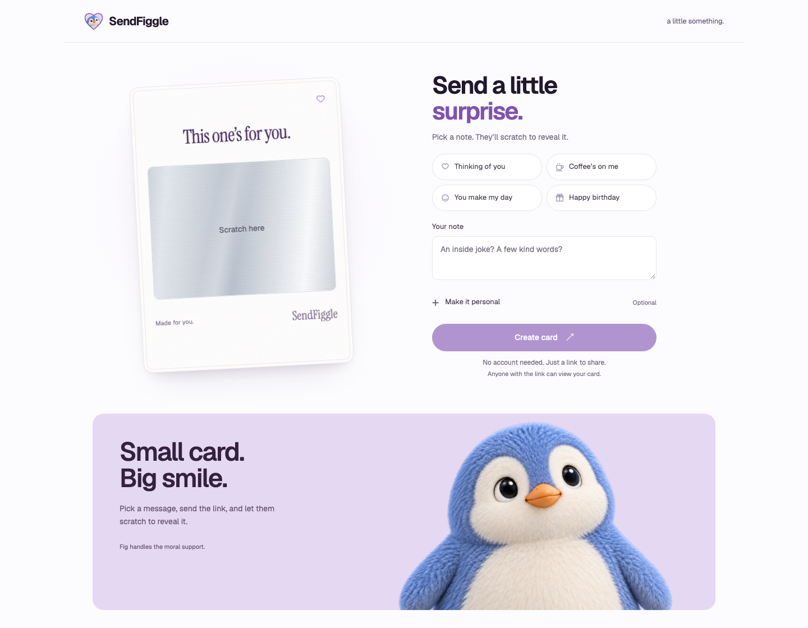

<p align="center"></p>
<h1 align="center">SendFiggle</h1>
<p align="center">A little surprise, delivered.</p>

Create a personal scratch-to-reveal card in seconds. Choose a note, optionally add a name or photo, then share its unique link. The recipient opens an animated envelope and scratches the foil to reveal the surprise. No account required.



## What’s included

- Four editable message presets and optional recipient/sender names.
- Photo upload or drag-and-drop, with server-side image validation.
- Silver, pink and gold scratch foil; mouse, touch and accessible button reveal.
- Real saved links, clipboard copying and native sharing where supported.
- A floating, cursor-responsive paper card and Fig’s dedicated character section.
- Responsive desktop/mobile layouts and automatic reduced-motion support.
- Generic social previews, recipient noindex metadata and branded icons.
- Supabase and PostHog integrations prepared for hosted deployment.

**Status:** the local app and its creation/sharing flow are verified. Public deployment, hosted storage and live analytics still require account configuration and verification. `sendfiggle.com` is the intended domain; it is not assumed to be purchased or connected. No paid service is provisioned by this repository.

## Run locally

Requires **Node.js 22+** and npm.

```sh
git clone https://github.com/edakturk14/greeting-card.git
cd greeting-card
npm ci
cp .env.example .env.local
npm start
```

Open **http://localhost:3001**. No service credentials are needed for local development. Cards and processed photos persist in the ignored `data/` directory across server restarts. Keep that directory if you want local links to keep working.

Local share links can use your computer’s private network address, allowing another device on the same Wi-Fi to open them while the server runs. These are not internet-accessible links.

### Avoid exhausting quotas while testing

Set this in your local `.env.local`, then restart the server:

```dotenv
APP_ENV=development
LOCAL_TEST_MODE=1
```

This bypasses the small durable creation quota **only for local, file-backed development**. It cannot bypass limits on Vercel, with cloud credentials, or in production. A 200-attempt/hour local request cap and all upload validation remain. Without it, the normal five-attempt/hour quota applies. Existing cards and counters are never cleared by this setting.

## How it works

1. Pick a preset or type into **Your note**. The card updates immediately.
2. Optionally open **Make it personal** for names, a photo and foil colour.
3. Click the foil to test scratching. Reset restores the coating without clearing the note/photo; previews are not saved.
4. **Create card** saves the content and returns a real, cryptographically random link. Copy it or use native sharing.
5. The recipient opens the envelope, then scratches or chooses **Reveal message**. Scratching about 43% reveals the rest. The revealed state is remembered on that device only.

Editing a saved card and creating again makes a new immutable version; existing sent links are preserved. Anyone with a link can view its card. Scratch foil is a presentation interaction, not encryption or an additional access control.

## Configuration

Keep secrets in `.env.local` or the hosting provider’s server environment, never in client code or Git.

| Variable | Purpose |
| --- | --- |
| `APP_ENV` | `development` locally; `production` for a public launch. |
| `PORT` / `DATA_DIR` | Local port (default `3001`) and persistent file directory (default `./data`). |
| `LOCAL_TEST_MODE` | Optional local-only quota bypass, described above. Leave off in production. |
| `SUPABASE_URL` | Hosted Supabase project URL. |
| `SUPABASE_SERVICE_ROLE_KEY` | Privileged server-only storage/database credential. |
| `APP_SECRET` | Random server secret, at least 32 characters, for hashing rate-limit identifiers. |
| `CRON_SECRET` | Random secret protecting cleanup requests. |
| `PUBLIC_BASE_URL` | Connected public HTTPS origin, such as your actual Vercel deployment URL. |
| `POSTHOG_KEY` / `POSTHOG_HOST` | Project analytics key and matching US/EU ingestion host. |
| `ANALYTICS_CAMPAIGNS` | Allowlist of nonpersonal campaign labels. |

Generate each server secret independently, for example with `openssl rand -hex 32`. Do not reuse the examples as credentials.

## Deploy to Vercel

1. Create a Supabase project and run [`db/schema.sql`](db/schema.sql) in its SQL editor. It configures the cards table, private photo bucket and creation-limit reservation function.
2. Import this repository into Vercel, using the repository root and Node.js 22. The build command, routes and cleanup schedule are in [`vercel.json`](vercel.json).
3. Configure the server environment: `APP_ENV=production`, Supabase credentials, `APP_SECRET`, `CRON_SECRET`, and your connected `PUBLIC_BASE_URL`. Add PostHog settings if enabling analytics. Do not use `DATA_DIR` as production persistence.
4. Deploy and verify create → copy → separate-browser open → envelope → scratch/reveal, including a photo and a page refresh. Confirm anonymous database/bucket access is denied and analytics events reach the hosted dashboard.

Production uses `PUBLIC_BASE_URL`, or Vercel’s configured production/deployment URL when that value is absent. The same origin drives canonical metadata, social images, sitemap entries and new share links. Local/private production origins are rejected before a card is saved. Production never falls back to ephemeral file storage.

Only change `PUBLIC_BASE_URL` to `https://sendfiggle.com` **after** connecting the domain and verifying DNS/HTTPS. Keep previous deployment addresses routed to the same app so existing links remain usable. Local file-backed cards are not automatically migrated to Supabase.

See [launch setup and service limits](docs/launch.md) for provider considerations and remaining checks. Provider allowances and plan eligibility must be rechecked before a public launch or paid upgrade.

## Privacy and safeguards

- Card IDs contain 192 bits of cryptographic randomness. There is no card-listing or public modification API.
- Hosted database and photo access is server-side; Supabase RLS and a private bucket deny direct browser access.
- Photos: one JPEG/PNG/WebP, up to 2 MiB and 20 megapixels. The server decodes, strips metadata, resizes and re-encodes the image. Unsupported/animated uploads are rejected.
- Default durable limits: 5 creation attempts/IP/hour, 20/IP/day, 50 total/day and 1,000 lifetime reservations. Failed upload attempts count. These intentionally conservative limits need review before scaling.
- Interrupted pending uploads are cleaned up after an hour. Completed cards are preserved.
- Recipient HTML/social metadata never embeds names, messages or uploaded photos. Recipient/API routes are noindex; the sitemap contains only the homepage. Noindex is not access control.
- Analytics uses an explicit allowlist, normalized recipient paths and no personal card content. Local traffic is excluded.

## Analytics

Use the hosted **PostHog** dashboard rather than an in-app admin panel. Events cover creator visits, previews, successful saves, copy/share actions, recipient opens, scratches, completed reveals and recipient-to-creator attribution where available.

See [analytics setup and event reference](docs/analytics.md) for dashboard instructions, privacy constraints and counting limitations. Live dashboard delivery has not yet been verified.

## Tests and recordings

```sh
npm test
npm run build
npx playwright install chromium
npm run test:ui
npm run record:demo
```

- `npm test`: isolated API tests for persistence, image handling, access controls, quotas, metadata, safe production URLs and analytics filtering.
- `npm run test:ui`: isolated desktop/mobile browser flow with scratch/reset, photo drop and persistence, copy/share, recipient envelope and remembered reveal.
- `npm run record:demo`: isolated desktop/mobile screenshots and a short card/scratch recording in `docs/screenshots/`.
- `node tests/envelope-photo.cjs`: isolated pixel-level regression for photo concealment, including previously revealed cards.

Some focused visual checks (`card-tilt`, `cover-line`, `disclosure-position`, `envelope`, `builder-motion`) expect `npm start` on port 3001. `local-smoke.cjs` explicitly creates one QA card in that running app; use it only when you intend to add local test data. Native OS sharing is stubbed in automated tests; it is not proof of delivery to a real share target.

[Desktop](docs/screenshots/initial-desktop.png) · [Mobile](docs/screenshots/initial-mobile.png) · [Card and scratch recording](docs/screenshots/fig-and-scratch.webm) · [Verification notes](docs/testing.md)

## Project map

```text
index.html / style.css   Responsive builder, recipient view and styling
app.js                  Editor, uploads, sharing and recipient orchestration
scratch.js              Canvas foil, scratching, reveal and celebration
scene.js                Fig’s motion and character reactions
lib/app.mjs             HTTP routes, validation, limits and image processing
lib/storage.mjs         Local files and Supabase persistence adapters
lib/metadata.mjs        Generic metadata and safe public-origin resolution
lib/analytics.mjs       Server-side analytics allowlist and delivery
db/schema.sql           Hosted database/storage setup
scripts/                Build and brand-asset rendering
 tests/                 API, browser and regression checks
archive/                Preserved earlier prototypes; not served by the app
```

The app uses vanilla HTML/CSS/JavaScript, Node.js and Sharp. No accounts, payments, automated email, AI generation or video generation are included.
